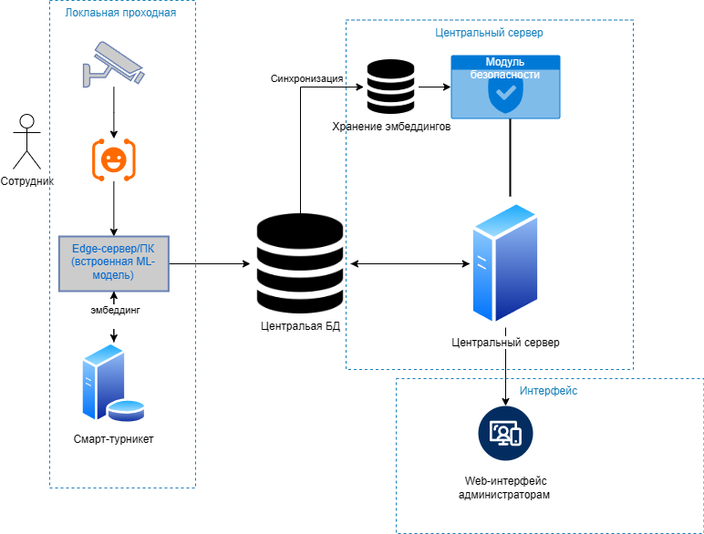
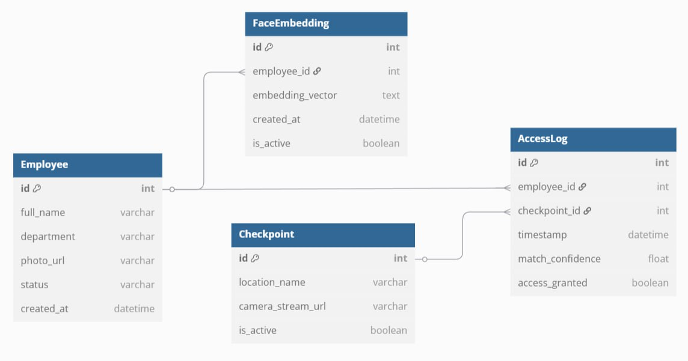
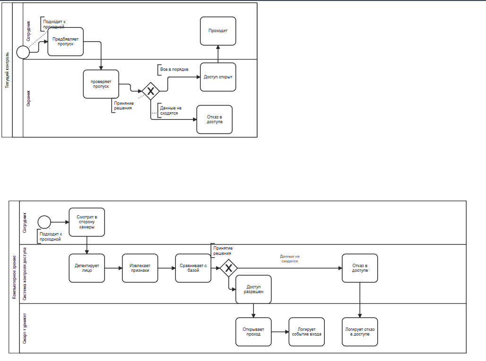
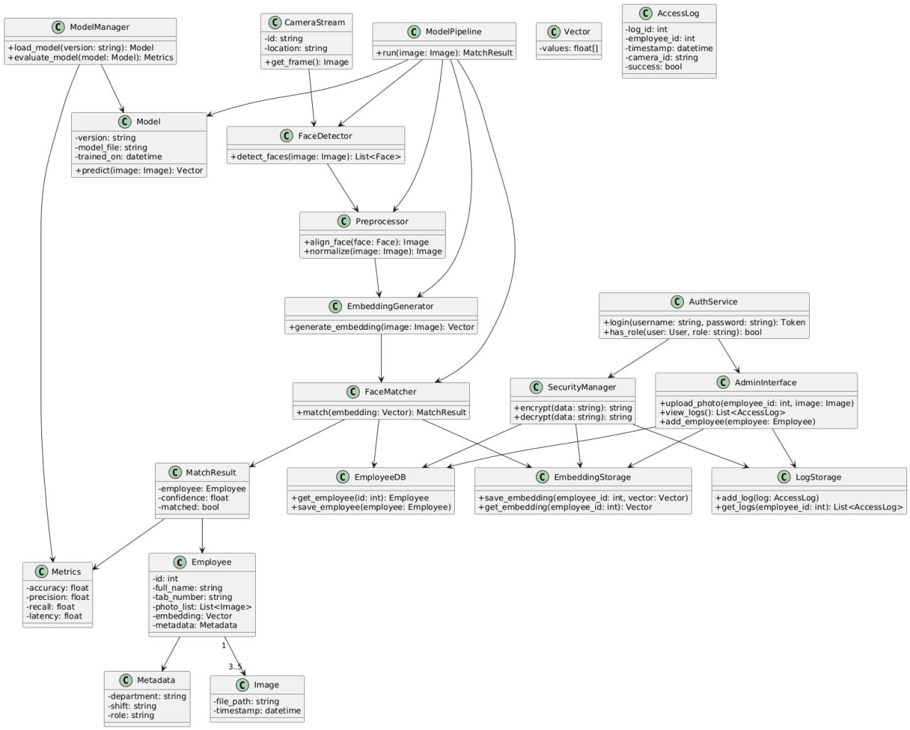
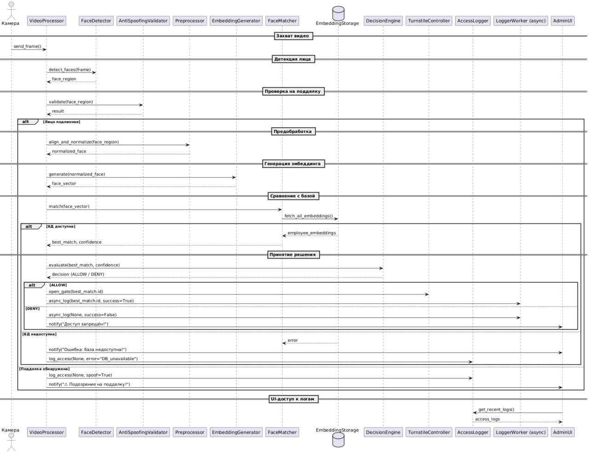

# ML System Design Doc — Автоматизированная система идентификации личности по фотографии

---

## Состава команды:

Трубников Андрей - software architect, data architect

Игнатьев Алексей - data engineer, data scientist

Цой Степан - product owner

---

## 1. Цели и предпосылки

### 1.1 Зачем идем в разработку продукта?

**Бизнес-цель:**  
Автоматизировать процесс контроля доступа на предприятии, заменив ручную проверку сотрудников по пропускам и фото более надежной системой компьютерного зрения для повышенияь безопасности, устрания человеческого фактора и снижения издержек на работу охраны.

**Почему ML:**

- ML-модель позволяет автоматически сверять лицо сотрудника с базой данных без участия охраны.
- Исключается субъективный "человеческий фактор" и риск ошибки.
- Снижается нагрузка на персонал КПП.
- Повышается пропускная способность.
- Система может работать 24/7.

---

### 1.2 Бизнес-требования и ограничения

**Бизнес-требования:**

- Узнавать сотрудников с точностью ≥ 97%.
- Время принятия решения ≤ 2 сек.
- Возможность масштабирования на 10+ проходных и 5000+ сотрудников.
- Интеграция с существующими системами безопасности и кадрового учёта.

**Ограничения:**

- Только локальная обработка (без облаков)
- Хранение биометрии только на территории предприятия
- Недостаточное освещение / качество видео с камер.

**Функциональные требования:**

- Загрузка и хранение эталонных изображений сотрудников.
- Генерация эмбеддингов и сохранение их в базу.
- Распознавание лица в реальном времени и принятие решения.
- Ведение логов входов/выходов.

**Нефункциональные требования:**

- Защита персональных данных (шифрование, доступ по ролям).
- Поддержка отказоустойчивости.

**Пилотный проект:**

1 проходная с 200 сотрудниками.

Критерии успеха:

- ≥ 97% точность распознавания лиц.
- ≤ 1% false positive (ошибочное распознавание чужого).
- ≤ 2,5 сек. задержки принятия решения.
- Безаварийная работа в течение 1 месяца.

---

### 1.3 Что входит в MVP, а что остается техническим долгом?

**Входит в MVP:**

- Обработка видео с одной камеры.
- Сравнение лица с вектором из базы.
- Интерфейс админа для загрузки фото.
- Логирование входов/выходов.

**Технический долг:**

- Оптимизация модели под слабое оборудование.
- Поддержка мультикамерных конфигураций.
- Обнаружение и защита от подмены (антиспуфинг).
- Механизмы самодиагностики.

---

### 1.4 Предпосылки решения

- HR-данные: фото сотрудников
- Камеры высокого разрешения
- Доступ к БД пропусков
- Работа в локальной сети предприятия

---

## 2. Методология

### 2.1 Что делаем с технической точки зрения

- **Задача классификации**: определение, принадлежит ли лицо на видео/фото одному из зарегистрированных сотрудников.
- **Распознавание лиц**: сравнение векторного представления лица с embedding-ами сотрудников.
- **Детекция лиц (face detection)**: выделение области лица в видеопотоке.
- **Предобработка изображений**: выравнивание, нормализация яркости, устранение искажений.
- **Видеопайплайн**: буферизация, кадрирование, фильтрация дубликатов.
- **Идентификация в реальном времени**: результат — ID сотрудника, отправляемый на турникет.

---

### 2.2 Какие данные нужны

#### Обязательные данные:

- **Фотографии сотрудников**:
  - 3–5 изображений на человека;
  - Разные ракурсы, освещение, выражения лиц.
- **Метаданные**:
  - ФИО, табельный номер, ID доступа;
  - Подразделение, смена, роль.
- **Видеопотоки с камер**
- **Логи турникетов**:
  - Факт прохода, время, ID камеры и сотрудника.

---

### 2.3 Метрики качества (ML-метрики)

| Метрика                 | Значение                                   | Бизнес-связь                     |
| ----------------------- | ------------------------------------------ | -------------------------------- |
| **True Positive Rate**  | Доля корректных распознаваний "своих"      | Нет задержек и жалоб на проходах |
| **False Positive Rate** | Доля "чужих", допущенных системой          | Критично для безопасности        |
| **Top-1 Accuracy**      | С первого раза правильно распознанное лицо | Повышение UX и скорости          |
| **Latency (мс)**        | Время ответа системы                       | Влияет на комфорт и throughput   |
| **Precision / Recall**  | Баланс точности и полноты                  | Анализ false cases               |
| **ROC AUC**             | Способность модели отделять классы         | Вторичная метрика для калибровки |

> Связь с бизнес-результатом:
>
> - **FPR ≤ 0.1%** — безопасность на проходных;
> - **TPR ≥ 98%** — скорость и комфорт для сотрудников.

---

### 2.4 Риски анализа и моделирования

| Риск                              | Меры противодействия                                |
| --------------------------------- | --------------------------------------------------- |
| Плохое качество фото из HR        | Ввести контроль качества и рекомендации по фото     |
| Изменения внешности сотрудников   | Периодическое обновление embedding'ов (раз в месяц) |
| Плохое освещение / ракурс         | Улучшение условий, настройка камер                  |
| Дублирование / похожие сотрудники | Комбинация embedding + ID-контекст                  |
| Пропуск кадров, низкий FPS        | Оптимизация пайплайна, кадр-скейлинг                |
| Накладка между проходами          | Учет таймингов и данных с турникета                 |
| Отсутствие размеченного видео     | Пилотный сбор с логами и ручной разметкой           |

---

## 3. Подготовка пилота

### 3.1 Оценка

- A/B тест: ручной режим vs автоматический
- Метрики:
  - Доля верных распознаваний
  - Время на проход
  - Количество ложных отказов / допусков

---

### 3.2 Критерии успеха

- ≥ 97% успешных распознаваний
- < 1% ложных допусков
- ≥ 50% ускорение процесса прохода

---

### 3.3 Подготовка

- Камеры Full HD
- Сервер с GPU
- Предварительное обучение модели
- Логирование всех решений.

---

## 4. Production-система

### 4.1 Архитектура
*Figure 1: Диаграмма архитектуры*

---

### 4.2 Инфраструктура

- Выбор: Гибрид — локальная обработка (edge) + централизованная БД (PostgreSQL).
- Плюсы: Низкие задержки, отказоустойчивость при потере интернета.
- Минусы: Необходимость синхронизации центра и периферии.

**Масштабирование:**

- Горизонтальное — установка edge-серверов на каждой проходной.
- Централизованное хранилище эмбеддингов для синхронизации.

---

### 4.3 Требования к работе системы

- SLA: ≥ 99.9%.
- RPS: до 5 RPS на точку (максимум).
- Latency: ≤ 2000 мс на идентификацию.

---

### 4.4 Безопасность системы

- HTTPS/TLS для всех API.
- Ролевой доступ в админке.
- Логирование доступа.

---

### 4.5 Безопасность данных

- Шифрование биометрических данных
- Локальное хранение эмбеддингов.
- Соблюдение ФЗ-152

---

### 4.6 Издержки

- Оценка: 200 000 ₽ / проходная

---

### 4.7 Точки интеграции

- REST API: сверка ID
- UI для администратора
- Синхронизация с HR (раз в сутки)

---

### 4.8 Основные риски

- Слабое освещение
- Неполноцеенность базы данных с фотографиями HR отдела.
- Ограничение ИТ-инфраструктуры на проходных
- Непредсказуемое поведение сотрудников (капюшон, маска, очки)

---

## Приложения
*Figure 2:  Диаграмма структуры данных *

*Figure 2:  Диаграмма бизнес процессов*

*Figure 3: Диаграмма классов*

*Figure 4: диаграмма последовательности*

---
